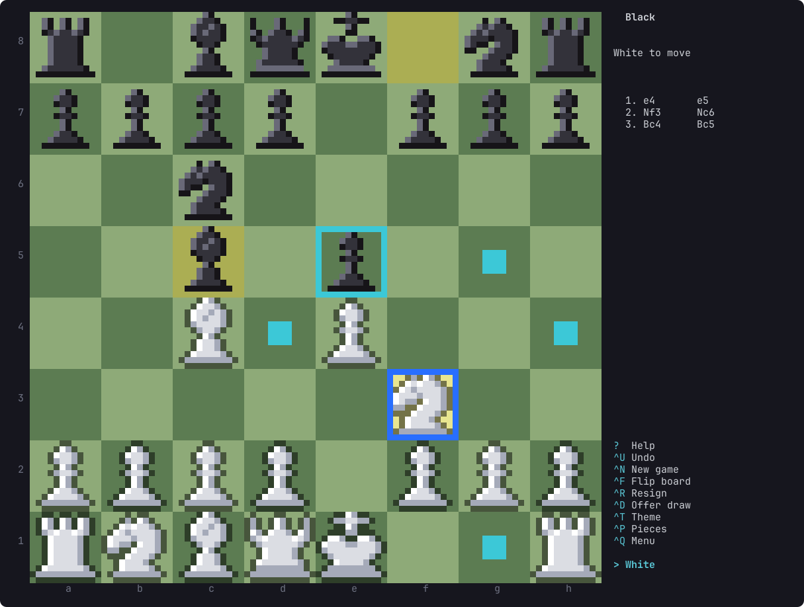

# funchess

Chess for the terminal, on Linux and macOS.



- **Against the computer**, at four levels (beginner, easy, medium, hard), as White or Black.
- **Two players at one keyboard.** The board turns to face whoever is to move.
- **Two players on two computers**, over a direct connection.
- **Made to be fun, for children most of all.** Pieces slide to their squares and the
  knight jumps, a captured piece bursts, a king in check shakes and a mated one falls
  over. The computer has a face that shows how it feels, a win gets confetti and
  stars, and `Ctrl-G` shows a good move when you are stuck. Moves, captures, checks
  and wins have their own sounds.

All the rules are in: castling, en passant, promotion, check, checkmate, stalemate,
and draws by repetition, the fifty-move rule and too few pieces.

## Install

funchess runs on macOS and Linux, on Intel and ARM. It is a single program with
nothing else to install; the terminal needs UTF-8, which every current one has.

### Homebrew (macOS and Linux)

```sh
brew install anwarahmed/tap/funchess
```

Update with `brew upgrade funchess`, remove with `brew uninstall funchess`.

### Install script

```sh
curl -fsSL https://raw.githubusercontent.com/anwarahmed/funchess/main/install.sh | sh
```

This downloads the latest release for your machine, checks its checksum, and puts it
in `~/.local/bin` (set `FUNCHESS_BIN_DIR` for somewhere else). A copy installed this
way keeps itself up to date (see [Updates](#updates)). Where there is no prebuilt
binary it builds from source instead, which needs Rust. To remove the game:

```sh
curl -fsSL https://raw.githubusercontent.com/anwarahmed/funchess/main/install.sh | sh -s -- --uninstall
```

### Arch Linux

Each [release](https://github.com/anwarahmed/funchess/releases/latest) carries a
`PKGBUILD` for the package `funchess-bin`. Download it into an empty directory and
build:

```sh
curl -fsSLO https://github.com/anwarahmed/funchess/releases/latest/download/PKGBUILD
makepkg -si
```

Remove it with `sudo pacman -R funchess-bin`. (The package is not in the AUR yet.)

### From source

Needs Rust 1.88 or newer.

```sh
git clone https://github.com/anwarahmed/funchess
cd funchess
cargo run --release
```

`./install.sh --source` builds and installs in one step; `./install.sh --link` links
`~/.local/bin/funchess` to the checkout's build, for development.

## Updates

| Installed with | How it updates |
| -------------- | -------------- |
| Install script | By itself: when it starts it checks for a newer release, at most once a day, installs it and restarts |
| Homebrew       | `brew upgrade funchess` |
| Arch package   | Build the newer `PKGBUILD` the same way |
| From source    | `git pull`, then build again |

Only the install script's copy updates itself. A copy that Homebrew or pacman owns is
marked as theirs when it is installed and never touches its own file, and neither does
a build run from a checkout.

For a copy that updates itself:

```sh
funchess update        # check now and install a newer release
funchess update off    # stop checking at startup ("on" turns it back on)
```

`FUNCHESS_NO_UPDATE=1` skips the check for one run. The check at startup happens at
most once a day (`funchess update` always checks), waits at most three seconds, and
says nothing when you are offline. An update is verified against the release's
SHA-256 checksum and never moves to an older version; if anything fails, the version
you have starts as usual.

Two players on two computers need versions that speak the same network messages; if
they do not, the game says so when they connect, and both should update.

## Playing

    funchess                    choose from the menu
    funchess computer -l hard   play the computer (add --black to play Black)
    funchess local              two players at this keyboard
    funchess host               wait for a player on another computer
    funchess join 192.168.1.20  join the game hosted there

Move a piece by picking it and then picking where it goes: click with the mouse,
or move the marker with the arrow keys and press Enter, or type the two squares
(`e2` `e4`).

In a game, commands are Ctrl with a letter, so no plain letter ever does anything but
name a square or answer a question. In the menu the letter alone is enough: `T`, `P`, `Q`.

| Key | |
|---|---|
| `Ctrl-G` | a hint: the two squares of a good move are framed (not in a network game) |
| `Ctrl-U` | take back a move (not in a network game) |
| `Ctrl-R` | resign |
| `Ctrl-D` | offer a draw |
| `Ctrl-N` | new game; in a network game, a rematch with colors swapped |
| `Ctrl-F` or `Tab` | flip the board (with two players at one keyboard it then faces whoever is not to move) |
| `Ctrl-T` | next color theme |
| `Ctrl-P` | next way of drawing the pieces |
| `Ctrl-Q` or `Esc` | back to the menu |
| `Ctrl-C` | quit at once |
| `?` | help |

When a game ends a box says who won and why, with the score, the number of moves, the
material and what you can do next: a new game, take the last move back, the menu, or
Enter to look at the final position. Beating the computer earns up to three stars: one
for the win, one for doing it without a hint or a take-back, and one for doing it in 40
moves or fewer.

The computer is a different character at each level: a chick (beginner), a cat (easy),
a robot (medium) and a dragon (hard). In a window large enough for pixel art its face is
beside the board, looking pleased, surprised or thoughtful and saying so, and the
pieces each player has captured are lined up on a tray.

Pieces are shown moving. A key or a click never waits for that: it ends whatever is
still moving and acts at once. `funchess --animations off` switches the movement off
(`on` brings it back), and that is remembered.

There are sounds for a move, a capture, castling, check, promotion, a hint, and for
winning, losing and drawing. They are played by a program your system already has:
`pw-play`, `paplay` or `aplay` on Linux, `afplay` on macOS; without one of them the
game is simply silent. `funchess --sound off` switches them off (`on` brings them
back), which is remembered, and `FUNCHESS_NO_SOUND=1` does it for one run.

Everything can also be clicked: the lines of the main menu (a setting steps
forward, or back from its `<`), the commands beside the board, and
the answers in a question box.

## Looks

Twelve color themes: forest, wood, ocean, slate, plum and ruby, and the more colorful
candy, sunset, neon, tropical, citrus and aurora. Five ways of drawing the pieces:

| Style | |
|---|---|
| `shaded` | pixel art lit from the top left (the default) |
| `solid` | flat pixel art |
| `outlined` | flat pixel art with a strong rim |
| `symbols` | the font's own chess symbols |
| `letters` | K Q R B N P, for fonts without chess symbols |

Change either with `T` and `P` in the menu (which shows a sample), with `Ctrl-T` and
`Ctrl-P` during a game, or start with `--theme ocean --pieces outlined`. The choice is remembered in
`~/.local/state/funchess/settings` (under `$XDG_STATE_HOME` when that is set), along
with the computer's level, whether pieces are shown moving and whether there is sound.

The board is as tall as the window allows. The players, the state of the game and
the commands are to its right, and the moves to its left when the window is wide
enough (otherwise they share the right side). Pixel art needs a window of at least
98 x 33 characters; in smaller ones (down to 58 x 9) the three pixel-art styles are
shown as chess symbols.

## Playing across two computers

One player runs `funchess host`, which shows the command for the other to type,
for example `funchess join 192.168.1.20`. The host picks the color (`--black`,
`--random`); the other player gets the one left.

The two programs talk directly to each other on TCP port 6464 (`funchess host 7000`
picks another). That works when both computers are on the same network, or on a
shared VPN such as Tailscale, or when the host's router forwards the port. There
is no server in between, so two home networks cannot reach each other without one
of those.

The host's firewall must allow the port; if it does not, the joiner is told there was
no answer. The host's waiting screen says when it sees the `ufw` firewall blocking the
port, and how to open it (`sudo ufw allow 6464/tcp`). On a Mac, allow incoming
connections for the terminal, or for funchess, when macOS asks or under System Settings,
Network, Firewall.

Each side checks the other's moves against the rules, and nothing but moves and
resign/draw/rematch messages is exchanged.

## Development

```sh
cargo test                               # rules, the computer's play, the network, drawing
cargo clippy --all-targets -- -D warnings
cargo build --release && tests/e2e.sh    # the built program in tmux, install.sh, the updater
```

`CLAUDE.md` describes how the code is laid out and why; `RELEASING.md` how a release
is made.

## License

MIT. See [LICENSE](LICENSE).
